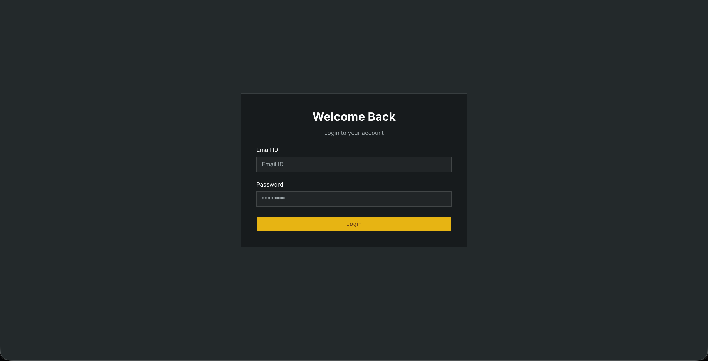
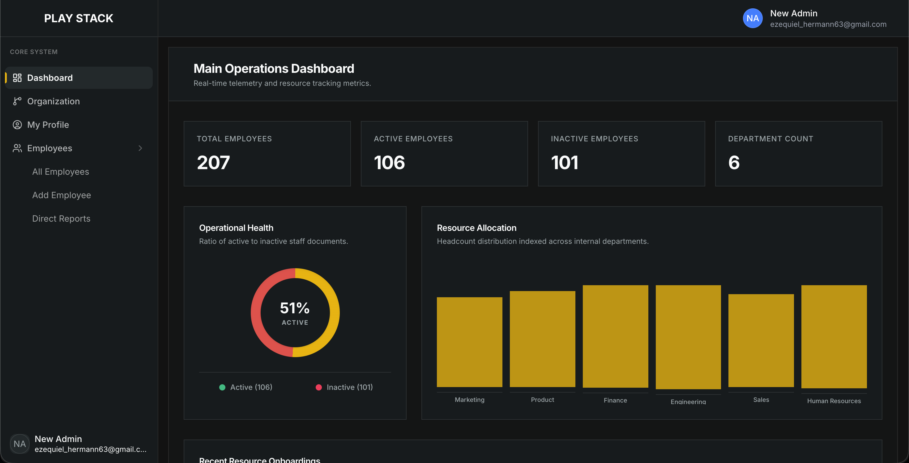
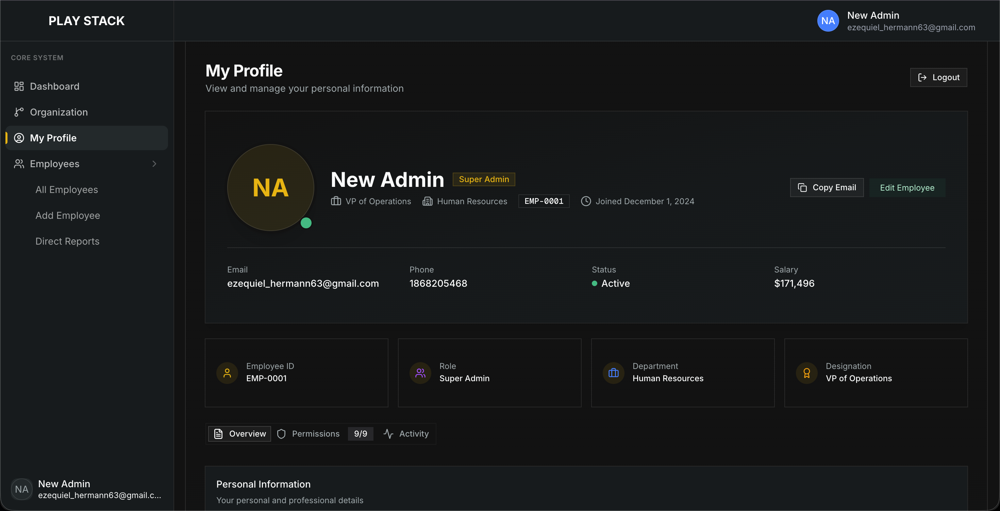
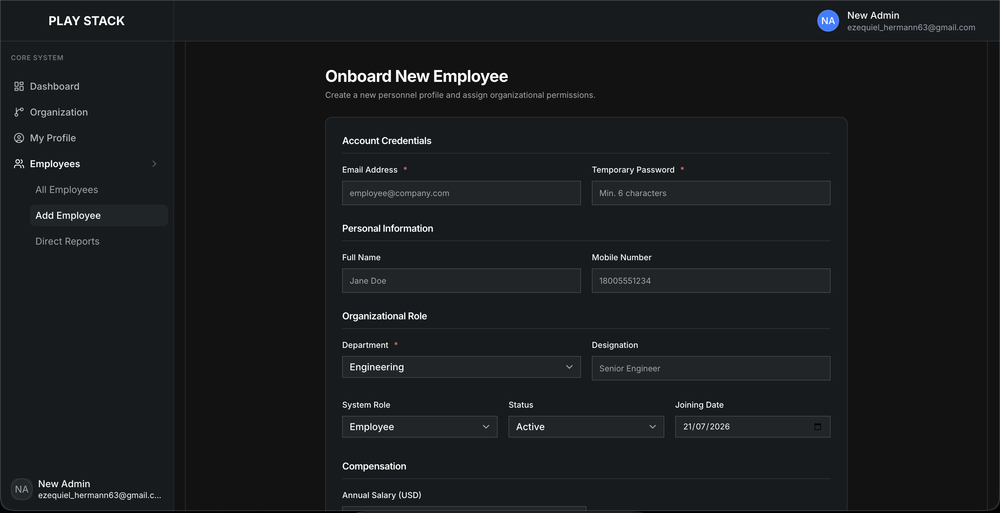
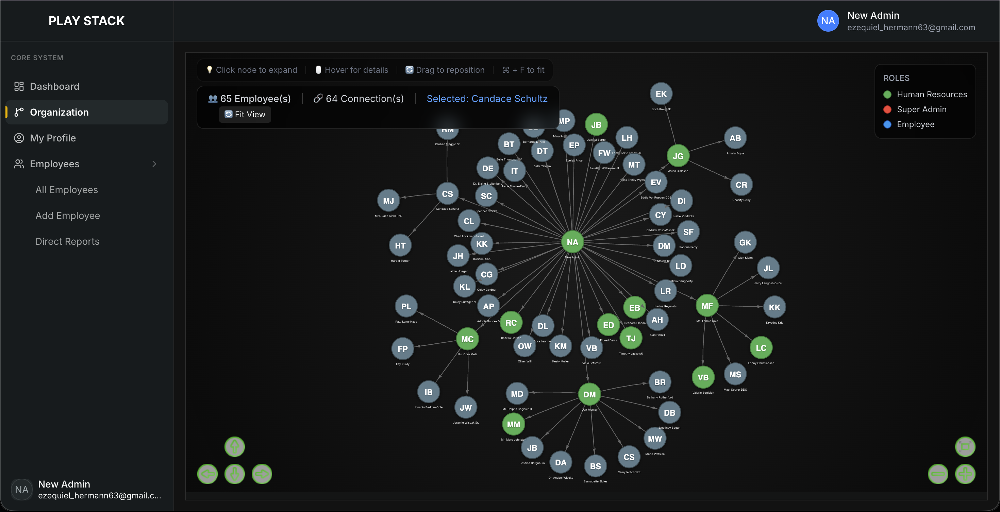
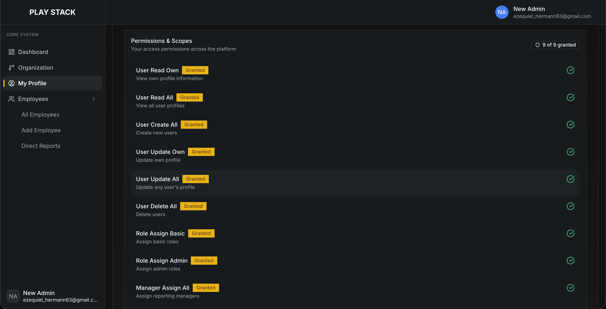

# Playstack Assessment

This repository contains a full-stack application designed for managing employee data, including profiles, roles, departments, and reporting structures within an organization. The application consists of a Next.js (React) frontend and an Express.js (Node.js) backend, utilizing MongoDB as its database.

---

## 🚀 Deployment Highlights

This project is deployed on an **EC2 instance** using **Docker** and **Docker Compose** for containerization and orchestration. **Nginx** acts as a reverse proxy, handling traffic distribution and SSL termination, ensuring secure and efficient delivery of the application. This setup provides a scalable and robust environment for the application.

You can access the deployed application at: [https://playstack-assessment.vercel.app/login](https://playstack-assessment.vercel.app/login)

---

## Table of Contents

- [Features](#features)
- [Technologies Used](#technologies-used)
- [Local Installation](#local-installation)
  - [Prerequisites](#prerequisites)
  - [Setup Steps](#setup-steps)
  - [Environment Variables](#environment-variables)
  - [Database Seeding](#database-seeding)
  - [Running the Application Locally](#running-the-application-locally)
- [Docker & Docker Compose](#docker--docker-compose)
  - [Building Docker Images](#building-docker-images)
  - [Running with Docker Compose](#running-with-docker-compose)
- [Implemented Functionality](#implemented-functionality)

## Features

- **User Authentication:** Secure login and logout functionality with JWT.
- **Dynamic Dashboard:** Real-time overview of employee statistics, including total, active, and inactive employees, department breakdown, and recent hires.
- **Employee Management:** Comprehensive CRUD (Create, Read, Update, Delete) operations for employee profiles, with search and pagination.
- **Organization Chart:** Visual representation of the reporting hierarchy within the company.
- **Role-Based Access Control (RBAC):** Granular permission management for various user actions (e.g., viewing all employees, updating profiles, assigning managers).

## Technologies Used

**Frontend (Client):**
- Next.js (React Framework)
- TypeScript
- Tailwind CSS
- Zustand (State Management)
- shadcn/ui (UI Components)
- react-d3-tree (Organization Chart Visualization)

**Backend (Server):**
- Node.js
- Express.js
- TypeScript
- MongoDB (with Mongoose ODM)
- JWT (for Authentication)
- Zod (for Validation)
- Bcrypt (for password hashing)

**Development Tools:**
- pnpm (Package Manager)
- Docker & Docker Compose
- Postman (API Testing)

## Local Installation

### Prerequisites

Before you begin, ensure you have the following installed on your machine:

-   **Node.js**: Version 18 or higher.
-   **pnpm**: A fast, disk space efficient package manager.
    ```bash
    npm install -g pnpm
    ```
-   **MongoDB**: A running instance of MongoDB. You can install it locally or use a cloud service like MongoDB Atlas.

### Setup Steps

1.  **Clone the repository:**
    ```bash
    git clone https://github.com/dnyaneshwar411/playstack-assessment.git
    cd playstack-assessment
    ```

2.  **Install dependencies for the server:**
    ```bash
    cd server
    pnpm install
    cd ..
    ```

3.  **Install dependencies for the client:**
    ```bash
    cd client
    pnpm install
    cd ..
    ```

### Environment Variables

Both the client and server require environment variables. Create `.env` files as described below.

#### Server (`server/.env`)

Create a file named `.env` in the `server/` directory and populate it with the following:

```ini
NODE_ENV=development
EXPRESS_PORT=1993

# MongoDB Connection
MONGOOSE_DB_URL="mongodb://127.0.0.1:27017/company_db" # Replace with your MongoDB URI

# JWT Configuration (for authentication)
JWT_SECRET_TOKEN="supersecretjwtkey" # Use a strong, random key in production
JWT_ACCESS_EXPIRATION=3600000 # 1 hour in milliseconds (example)
JWT_REFRESH_EXPIRATION=259200000 # 3 days in milliseconds (example)

# Email Configuration (for potential future features or admin notifications)
EMAIL="your-email@example.com"
EMAIL_HOST="smtp.mailtrap.io"
EMAIL_PORT="2525"
EMAIL_USER="your-email-user"
EMAIL_PASSWORD="your-email-password"
EMAIL_FROM="your-email@example.com"

# Mongoose Pool Size (optional)
MONGOOSE_MAX_POOL_SIZE=10
MONGOOSE_MIN_POOL_SIZE=2
```

#### Client (`client/.env.local`)

Create a file named `.env.local` in the `client/` directory and populate it with the following:

```ini
NEXT_PUBLIC_API_BASE_URL="http://localhost:1993" # Must match your server's exposed port
```

### Database Seeding

The project includes a seeder script to populate your MongoDB with dummy employee data, including super admins, HR, and regular employees with a hierarchical structure. This is useful for development and testing.

1.  Navigate to the `server` directory:
    ```bash
    cd server
    ```
2.  Run the seeder script:
    ```bash
    pnpm seed
    ```
    This will create 20 users by default and output their plain-text credentials (email/password) to `server/src/seed/users.json`. You can modify the number of users by running `pnpm seed --users <NUMBER>`.
3.  After seeding, you can use the credentials from `server/src/seed/users.json` to log in to the application.

### Running the Application Locally

1.  **Start the server:**
    Navigate to the `server` directory and run:
    ```bash
    cd server
    pnpm dev
    ```
    The server will start on `http://localhost:1993` (or the port specified in `EXPRESS_PORT`).

2.  **Start the client:**
    Open a new terminal, navigate to the `client` directory and run:
    ```bash
    cd client
    pnpm dev
    ```
    The client application will be accessible at `http://localhost:3000`.

## Docker & Docker Compose

The application can be containerized and run using Docker and Docker Compose, simplifying the setup and deployment process.

### Building Docker Images

First, you need to build the Docker image for the server. Ensure you are in the root directory of the project.

1.  Navigate to the `server` directory:
    ```bash
    cd server
    ```
2.  Build the Docker image:
    ```bash
    docker build -t playstack-assessment-api:latest .
    ```
    This command builds the image named `playstack-assessment-api` from the `Dockerfile` in the `server` directory.

### Running with Docker Compose

The `docker-compose.yml` file orchestrates the `api` service.

1.  Ensure you have your `server/.env` file configured as described in the [Environment Variables](#environment-variables) section.
2.  From the root directory of your project, run:
    ```bash
    docker-compose up
    ```
    This will start the server in a Docker container. The API will be accessible on port `1993`.
    If you want to run it in the background:
    ```bash
    docker-compose up -d
    ```
3.  To stop the running containers:
    ```bash
    docker-compose down
    ```

### API Testing with Postman

An OpenAPI/Postman collection is provided at `server/http-client/playstack-api.json` to facilitate API testing.

1.  **Download and Install Postman:** If you don't have Postman, download it from [Postman's official website](https://www.postman.com/downloads/).
2.  **Import the Collection:**
    *   Open Postman.
    *   Click on "Import" in the top left corner.
    *   Select the `server/http-client/playstack-api.json` file.
    *   This will import a collection named "Collection" (you can rename it).
3.  **Set up Environment Variable:**
    *   The collection uses an environment variable named `LOCAL`.
    *   In Postman, create a new environment or add a variable to an existing one.
    *   Set the variable `LOCAL` to `http://localhost:1993/api/v1` (or your server's API base URL if it's different).
    *   Make sure this environment is active when running requests from the collection.
4.  **Test Endpoints:** You can now explore the API endpoints for authentication and user management provided in the collection. Remember to use the credentials from `server/src/seed/users.json` for login requests if you have seeded your database.

## Implemented Functionality

This section details the core functionalities implemented in the application.

### 1. Authentication

-   **User Login:** Users can log in using their email and password. Upon successful login, JWT tokens are issued and stored as HTTP-only cookies.
    
    
    
-   **User Logout:** Securely logs out the user by clearing the authentication cookies.

### 2. Dashboard

The dashboard provides a high-level overview of the company's employee data.

-   **Summary Statistics:** Displays key metrics such as total employees, active employees, inactive employees, and the number of distinct departments.
-   **Operational Health:** A donut chart visually representing the ratio of active to inactive staff.
-   **Resource Allocation:** A bar chart showing the headcount distribution across different departments.
-   **Recent Hires:** A table listing the most recently onboarded personnel profiles.
    
    
    
### 3. Employee Management

A dedicated section for managing all aspects of employee data.

-   **Employee Directory:**
    -   Lists all employees with their essential details (ID, name, email, department, designation, salary, status).
    -   Includes search functionality (by name, email, or ID) and pagination for efficient navigation through large datasets.
    
    
    
-   **Employee Details View:**
    -   Provides a detailed view of an individual employee's profile, including personal information, organizational role, contact details, joining date, and account creation date.
    -   Displays the employee's assigned permissions (scopes).
    -   Allows direct editing and deletion of the employee profile (for authorized users).
    
    
    
-   **Add New Employee:**
    -   A form to onboard new employees into the system.
    -   Captures account credentials (email, temporary password), personal information (name, mobile number), organizational role (department, designation, system role, status, joining date), and compensation (annual salary).
    
    
    
-   **Edit Employee:**
    -   Authorized users can update existing employee details.
    -   (Demonstrated in Employee Details and Employee Directory via a modal or dedicated page).

-   **Delete Employee:**
    -   Authorized users can delete employee records from the system.
    -   Includes a confirmation prompt to prevent accidental deletions.
    -   (Demonstrated in Employee Details and Employee Directory via a confirmation alert).

### 4. Organization Structure

-   **Organization Chart:**
    -   Dynamically visualizes the reporting hierarchy of the organization.
    -   Allows users to explore the chain of command and reporting relationships.
    
    
    
### 5. Role-Based Access Control (RBAC)

The application implements a robust RBAC system to control user access to different features and data.

-   **Permission Management:**
    -   Permissions are defined as "scopes" (e.g., `user:read:own`, `user:update:all`, `manager:assign:all`).
    -   Super Admin and HR roles have different sets of default permissions.
    -   Employee profiles include a dedicated tab to view and (for authorized roles) modify their assigned scopes.
    
    

***
**Note:** The image paths used above are placeholders. Please ensure to replace `images/login_page.png`, `images/dashboard_overview.png`, etc., with the actual paths to your image files within an `images/` directory relative to the `README.md`, or with their respective URLs.
